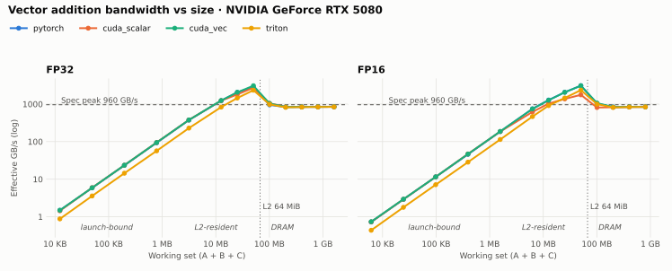

# HPC GPU Kernel Lab

A collection of 50 GPU kernel studies spanning array operations, matrix
multiplication, normalization, attention, and inference workloads. The project
explores CUDA and Triton implementations alongside PyTorch and JAX baselines,
with correctness testing, reproducible benchmarks, and hardware profiling.

Each study examines how an algorithm maps to GPU hardware: memory access,
parallel execution, resource limits, and the performance impact of optimization.
Problem documentation includes implementation details, validation status, and
measured results as they become available.

## Results so far

[**01 · Vector Addition**](problems/vector_add/README.md) on an RTX 5080: one
launch-bound, one L2-resident and one DRAM-bound regime, and the kernel changes
that do or do not move each one.

<picture>
  <source media="(prefers-color-scheme: dark)" srcset="problems/vector_add/figures/bandwidth_vs_size_dark.svg">
  
</picture>

- Large vectors stream from DRAM at 85–90% of the 960 GB/s spec peak on every backend.
- 16-byte vector loads make FP16 5.5% faster than scalar access (2.2% faster than
  PyTorch); for FP32 they cut instructions 64% but leave latency within ±1%.
- Capped grid-stride loops cost more than vectorization saves: up to 2.6% for FP32.

## Roadmap

Validation details are recorded in each problem README.

Status: ⬜ Planned · 🟨 In Progress · ✅ Complete · 🚀 Optimized.

| # | Problem | CUDA | Triton | PyTorch | JAX | Primary lesson | Status |
| ---: | --- | :---: | :---: | :---: | :---: | --- | --- |
| 01 | [Vector Addition](problems/vector_add/README.md) | ✅ | ✅ | ✅ | ✅ | Launch overhead vs bandwidth | ✅ Complete |
| 02 | [ReLU](problems/relu/README.md) | — | — | — | — | Predication and branching | ⬜ Planned |
| 03 | [Reverse Array](problems/reverse_array/README.md) | — | — | — | — | Race-free in-place indexing | ⬜ Planned |
| 04 | [Interleave Arrays](problems/interleave_arrays/README.md) | — | — | — | — | Lane-to-output mapping | ⬜ Planned |
| 05 | [RGB to Grayscale](problems/rgb_to_grayscale/README.md) | — | — | — | — | Interleaved channel access | ⬜ Planned |
| 06 | [Rainbow Table](problems/rainbow_table/README.md) | — | — | — | — | Integer instruction throughput | ⬜ Planned |
| 07 | [Matrix Copy](problems/matrix_copy/README.md) | — | — | — | — | Memory bandwidth ceiling | ⬜ Planned |
| 08 | [Matrix Transpose](problems/matrix_transpose/README.md) | — | — | — | — | Shared-memory bank conflicts | ⬜ Planned |
| 09 | [1D Convolution](problems/convolution_1d/README.md) | — | — | — | — | Halo reuse in shared memory | ⬜ Planned |
| 10 | [Gaussian Blur](problems/gaussian_blur/README.md) | — | — | — | — | Separable filtering tradeoffs | ⬜ Planned |
| 11 | [2D Max Pooling](problems/max_pooling_2d/README.md) | — | — | — | — | Overlapping window locality | ⬜ Planned |
| 12 | [Weight Dequantization](problems/weight_dequantization/README.md) | — | — | — | — | Scale-tile locality | ⬜ Planned |
| 13 | [Reduction](problems/reduction/README.md) | — | — | — | — | Warp-level reduction | ⬜ Planned |
| 14 | [Count Array Element](problems/count_array_element/README.md) | — | — | — | — | Predicate reduction | ⬜ Planned |
| 15 | [Mean Squared Error](problems/mean_squared_error/README.md) | — | — | — | — | Map-reduce fusion | ⬜ Planned |
| 16 | [Dot Product](problems/dot_product/README.md) | — | — | — | — | Fused multiply-accumulate reduction | ⬜ Planned |
| 17 | [Prefix Sum](problems/prefix_sum/README.md) | — | — | — | — | Cross-block prefix propagation | ⬜ Planned |
| 18 | [Histogramming](problems/histogramming/README.md) | — | — | — | — | Atomic contention | ⬜ Planned |
| 19 | [Stream Compaction](problems/stream_compaction/README.md) | — | — | — | — | Stable parallel filtering | ⬜ Planned |
| 20 | [Parallel Merge](problems/parallel_merge/README.md) | — | — | — | — | Balanced irregular partitioning | ⬜ Planned |
| 21 | [Dense GEMV](problems/dense_gemv/README.md) | — | — | — | — | Low-arithmetic-intensity matrix math | ⬜ Planned |
| 22 | [Sparse Matrix-Vector Multiplication](problems/sparse_matvec/README.md) | — | — | — | — | Irregular sparse memory access | ⬜ Planned |
| 23 | [Matrix Multiplication](problems/matrix_multiplication_fp32/README.md) | — | — | — | — | Shared-memory data reuse | ⬜ Planned |
| 24 | [Batched Matrix Multiplication — FP32](problems/batched_matmul_fp32/README.md) | — | — | — | — | Batch scheduling and occupancy | ⬜ Planned |
| 25 | [General Matrix Multiplication (GEMM) — FP16](problems/gemm_fp16/README.md) | — | — | — | — | Tensor Core utilization | ⬜ Planned |
| 26 | [FP16 Batched Matrix Multiplication](problems/batched_matmul_fp16/README.md) | — | — | — | — | Mixed-precision batch utilization | ⬜ Planned |
| 27 | [INT8 Quantized MatMul](problems/int8_quantized_matmul/README.md) | — | — | — | — | Quantized arithmetic contracts | ⬜ Planned |
| 28 | [Sparse Matrix-Dense Matrix Multiplication](problems/sparse_dense_matmul/README.md) | — | — | — | — | Sparse reuse across output columns | ⬜ Planned |
| 29 | [Fused GEMM + Bias + Activation](problems/fused_gemm_epilogue/README.md) | — | — | — | — | GEMM epilogue fusion | ⬜ Planned |
| 30 | [Sigmoid Linear Unit](problems/silu/README.md) | — | — | — | — | Special-function throughput | ⬜ Planned |
| 31 | [Swish-Gated Linear Unit](problems/swiglu_activation/README.md) | — | — | — | — | Elementwise gating fusion | ⬜ Planned |
| 32 | [Softmax](problems/softmax/README.md) | — | — | — | — | Numerically stable fused reduction | ⬜ Planned |
| 33 | [RMS Normalization](problems/rms_norm/README.md) | — | — | — | — | Normalization traffic and precision | ⬜ Planned |
| 34 | [Layer Normalization](problems/layer_norm/README.md) | — | — | — | — | Stable variance reduction | ⬜ Planned |
| 35 | [Batch Normalization](problems/batch_norm/README.md) | — | — | — | — | Reduction-axis layout | ⬜ Planned |
| 36 | [Fused Residual Add and RMS Norm](problems/fused_residual_rms_norm/README.md) | — | — | — | — | Residual-normalization fusion | ⬜ Planned |
| 37 | [Categorical Cross Entropy Loss](problems/categorical_cross_entropy/README.md) | — | — | — | — | Fused log-sum-exp loss | ⬜ Planned |
| 38 | [Rotary Positional Embedding](problems/rope/README.md) | — | — | — | — | Positional pair layouts | ⬜ Planned |
| 39 | [SwiGLU MLP Block](problems/swiglu_mlp/README.md) | — | — | — | — | MLP fusion boundaries | ⬜ Planned |
| 40 | [Softmax Attention](problems/softmax_attention/README.md) | — | — | — | — | Attention pipeline decomposition | ⬜ Planned |
| 41 | [Causal Self-Attention](problems/causal_attention/README.md) | — | — | — | — | Causal masking and triangular work | ⬜ Planned |
| 42 | [Multi-Head Attention](problems/multi_head_attention/README.md) | — | — | — | — | Head layout and scheduling | ⬜ Planned |
| 43 | [Attention with Linear Biases](problems/alibi_attention/README.md) | — | — | — | — | Fused attention bias generation | ⬜ Planned |
| 44 | [Grouped Query Attention](problems/grouped_query_attention/README.md) | — | — | — | — | Shared K/V head reuse | ⬜ Planned |
| 45 | [Decaying Causal Attention](problems/decaying_causal_attention/README.md) | — | — | — | — | Recurrence vs quadratic materialization | ⬜ Planned |
| 46 | [Quantize / Dequantize Pipeline](problems/quantization_pipeline/README.md) | — | — | — | — | Quantization error vs bandwidth | ⬜ Planned |
| 47 | [KV-Cache Update and Paged Access](problems/kv_cache_operations/README.md) | — | — | — | — | Stateful cache layout | ⬜ Planned |
| 48 | [FlashAttention-Style Online Attention](problems/flash_attention/README.md) | — | — | — | — | Numerically stable online reduction | ⬜ Planned |
| 49 | [Paged Attention](problems/paged_attention/README.md) | — | — | — | — | Irregular decode-time attention | ⬜ Planned |
| 50 | [MoE Token Routing and Dispatch](problems/moe_token_routing/README.md) | — | — | — | — | Balanced scatter and expert dispatch | ⬜ Planned |

## Development

See the [testing methodology](docs/methodology.md),
[benchmarking guidelines](docs/benchmarking.md), and
[profiling workflow](docs/profiling.md) for the study process.
Setup and execution commands are documented in each problem README.

Contribution requirements are described in [CONTRIBUTING.md](CONTRIBUTING.md).
