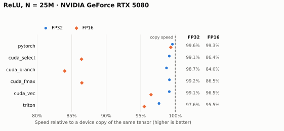

# 02 · ReLU

`out[i] = max(0, x[i])`: a one-instruction kernel for studying how the compiler lowers a
condition (branch or predication) and how much load width matters once the arithmetic is
trivial.

**Status:** ✅ Complete · validated and measured on NVIDIA GeForce RTX 5080 ·
primary lesson: **predication and branching** · prerequisite:
[01 · Vector Addition](../vector_add/README.md).



## Key results

RTX 5080, N = 25M. A device copy of the same tensor moves the same bytes, so it is the
practical speed limit. Details are in [results](docs/results.md).

- **The compiler never branches.** Even an explicit `if/else` becomes predicated
  instructions; Nsight Compute finds no data-dependent divergent branches in any variant
  or sign pattern.
- **FP32: the formula does not matter.** Every backend runs at 97.6–99.6% of copy speed.
- **FP16/BF16: load width matters.** Scalar kernels move 2 bytes per access and leave
  DRAM only ~67% busy (84–87% of copy speed); 16-byte loads (`cuda_vec`, Triton,
  PyTorch) reach 95.5–99.3%.
- **`if/else` costs ~1.3% when signs mix inside a warp.** It compiles to two predicated
  stores, so a mixed warp issues two store instructions instead of one.

## Documentation

| Page | Contents |
|---|---|
| [Design](docs/design.md) | Source contract, edge-case policy, performance model, the variants |
| [Results](docs/results.md) | Latency per backend, why the variants differ, sign patterns, small inputs, limitations |
| [Testing](docs/testing.md) | Test cases, running the suite, Compute Sanitizer |
| [Benchmarking](docs/benchmarking.md) | Commands, copy reference, reproduction sweep |
| [Profiling](docs/profiling.md) | Capturing one launch, Nsight metrics, reading SASS |

## Quick start

From the repository root, after [setup](../vector_add/docs/testing.md#setup):

```bash
python -m pytest -q problems/relu
python -m lab.bench relu --copy-reference --peak-gb-s 960
```

```python
import torch

from problems.relu.api import relu

x = torch.randn(1025, device="cuda")
# Backends: pytorch, cuda_select, cuda_branch, cuda_fmax, cuda_vec, triton
y = relu(x, backend="cuda_vec")
```

## Layout

```text
relu/
├── README.md        overview (this page)
├── api.py           public entry point, contract, backends and tolerances
├── cases.py         sizes and sign distributions for tests and benchmarks
├── pytorch/         reference: torch.relu
├── cuda/            four kernels (select, branch, fmax, vec), bindings, loader
├── triton/          masked-tile Triton kernel
├── tests/           source examples, every backend against the reference
├── benchmarks/      sweep.sh, profile.py (capture range), plot.py
├── figures/         generated chart (tracked)
└── docs/            design, results, testing, benchmarking, profiling
```
